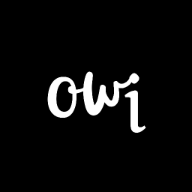

<div align="center">



# owI-FinancialTrack

**Aplikasi pencatatan keuangan pribadi yang simpel, privat, dan powerfull.**  
Dibangun murni dengan Vanilla JS (ES6 Module) & PWA tanpa framework apapun.

[](https://github.com/owi-apps/owI-FinancialTrack/stargazers)
[](https://github.com/owi-apps/owI-FinancialTrack/blob/main/LICENSE)
[](https://owi-apps.github.io/owI-FinancialTrack/)

</div>

---

## 🌟 Fitur Utama

- 📊 **Dashboard Interaktif** — Ringkasan saldo, perbandingan pemasukan/pengeluaran hari ini & bulan ini, skor kesehatan keuangan, hingga saran keuangan dinamis.
- 💰 **Multi-Akun / Dompet** — Mendukung Cash, Bank, E-Wallet, Crypto, dll. Mudah menambah dan mengelola akun baru.
- 🔄 **Mutasi Saldo** — Transfer antar akun dengan konfirmasi validasi.
- 📝 **Pencatatan Transaksi** — Pemasukan & Pengeluaran dengan kategori chip yang mudah dipilih.
- 📑 **Manajemen Hutang & Piutang** — Catat hutang/piutang, lengkap dengan fitur bayar full, cicil, dan upload bukti foto.
- 📜 **Riwayat Lengkap** — Log seluruh aktivitas (Transaksi, Mutasi, Log Sistem) yang bisa difilter.
- 🌙 **Dark & Light Mode** — Tema elegan dengan warna army-green khas owI-FinTrack.
- 🌐 **Multi-Bahasa (i18n)** — Mendukung Bahasa Indonesia & English.
- 📱 **Installable PWA** — Bisa diinstall di Homescreen HP (Android/iOS) seperti aplikasi asli.
- 🔒 **Privasi Terjamin** — 100% data tersimpan di LocalStorage perangkatmu, tidak ada data yang dikirim ke server manapun.

---

## 🚀 Demo & Instalasi

Coba langsung aplikasinya di browser mu:
👉 **[owI-FinancialTrack Live Demo](https://owi-apps.github.io/owI-FinancialTrack/)**

### Cara Install di HP (PWA)
1. Buka link demo di atas menggunakan **Chrome (Android)** atau **Safari (iOS)**.
2. Di Android: Klik tombol **"Install"** di header aplikasi, atau pilih "Add to Home screen" dari menu browser (⋮).
3. Di iOS: Tekan tombol **Share** (kotak panah atas), lalu pilih **"Add to Home Screen"**.
4. Aplikasi siap dipakai layaknya native app!

---

## 🛠️ Tech Stack

- **Frontend:** Vanilla JavaScript (ES6 Module), HTML5, CSS3 (Custom Properties)
- **Styling:** Custom CSS Variables, Responsive Design, Backdrop Filter UI
- **Storage:** Browser LocalStorage (Offline-first)
- **PWA:** Service Worker, Web App Manifest, Cache API
- **Icons:** Lucide Icons

---

## 📂 Struktur Folder

Proyek ini dirancang dengan arsitektur **Modular ES6** agar mudah di-maintain dan di-scale:

```text
owI-FinancialTrack/
├── index.html              # Entry point utama
├── manifest.json           # Konfigurasi PWA
├── sw.js                   # Service Worker (Caching & Offline)
├── assets/
│   └── icons/              # Icon PWA (192x192 & 512x512)
├── css/
│   └── style.css           # Styling global, variabel warna & tema
└── js/
    ├── app.js              # Orchestrator / Init script utama
    ├── db.js               # State management & LocalStorage handler
    ├── i18n.js             # Translation (ID/EN)
    ├── ui.js               # Core UI (Sidebar, Navbar, Toast, Modal)
    ├── utils.js            # Helper (Format Rupiah, AutoFit Text)
    └── pages/
        ├── dashboard.js    # Logika halaman Dashboard & Health Score
        ├── mutation.js     # Logika Mutasi Saldo antar Akun
        ├── transaction.js  # Logika Pemasukan & Pengeluaran
        ├── bills.js        # Logika Hutang, Piutang & Upload Bukti
        ├── history.js      # Logika Riwayat & Log Aktivitas
        └── sidebar.js      # Logika Profile, Chart of Account & Setting
